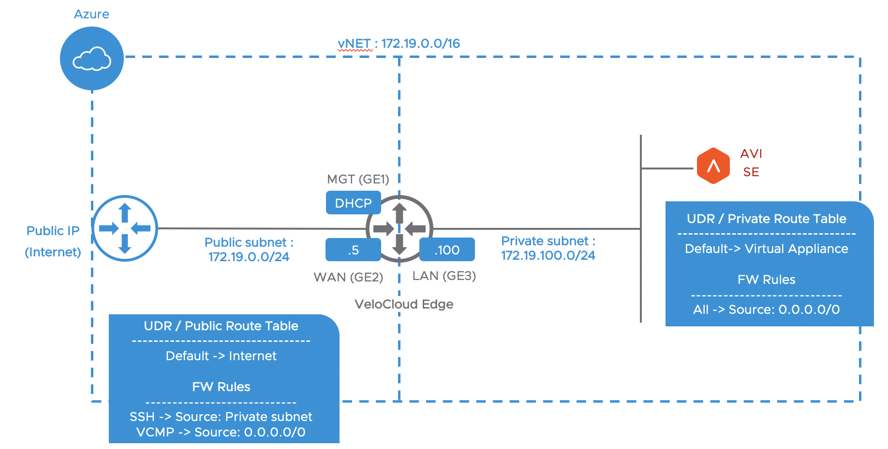

# terraform-velocloud-azure

Deploy a VeloCloud Edge on Azure via Terraform.

This example is for DEMO purpose ONLY

Before to execute the "tfapply.sh" script, you have to provide the following requirements:

1- Create an Edge profile and configuration on Velocloud Orchestrator (VCO),

2- Provide the Activation Code AND the VCO address in the "cloud-init" file,

3- Customize the Azure parameters in the terraform variable file, Note: Your Azure credentials already exist in your home directory

4- Accept the legal terms of the Velocloud image. For that, you can use the Azure CLI:

4a- To list all Velocloud images: "az vm image list --publisher velocloud --all"

4b- To Accept the legal terms: "az vm image terms accept --urn velocloud:velocloud-virtual-edge-3x:velocloud-virtual-edge-3x:3.3.2"

To connect to the VeloCloud Edge via SSH, the private key will provide at the end of "tfapply.sh" execution. copy the private key in a file named "vce.pem".
The VCE SSH access is only possible from a VM deployed in the Azure private subnet. You should consider to deploy a jumpserver. In this case, do not forget to add the IP@ under VCO -> Configure Edge -> Firewall -> Edge Access

To destroy the VeloCloud Edge and the environment, execute the "tfdestroy.sh" script.

Finally, every time you create or recreate the VeloCloud, you have to create a new Edge config in VCO to get the new Activation Code OR you can do a RMA and generate the new Activation Code under VCO -> Configure Edge -> Edge Overview -> RMA Reactivation

Enjoy !
